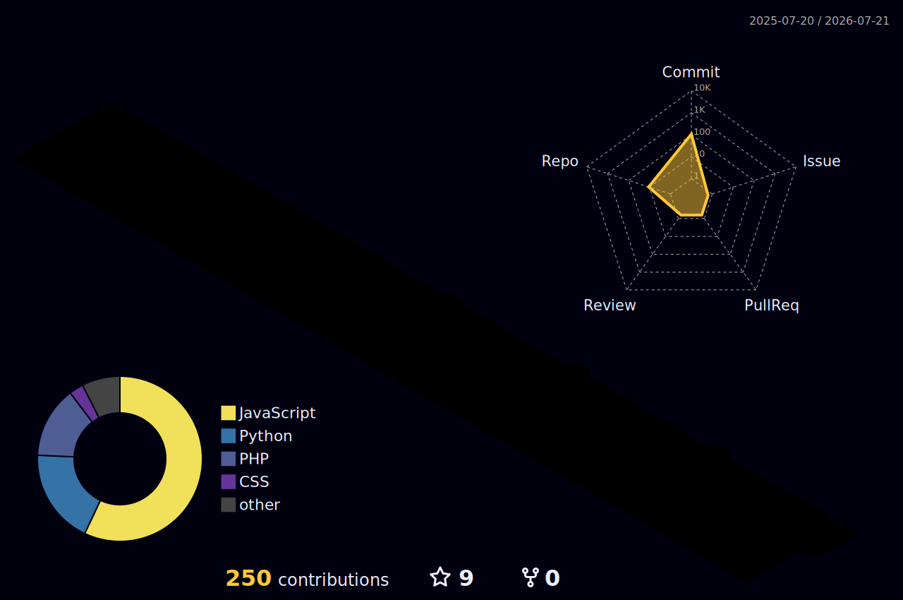

<div align="center">
  
</div>

<br/>

<div align="center">
  <a href="https://github.com/BSSE23105">
    
  </a>
</div>

<p align="center">
  
  &nbsp;
  <a href="https://github.com/BSSE23105?tab=followers"></a>
  &nbsp;
  
</p>

---

## 🧑‍💻 About Me

Software Engineering student at **ITU Lahore** (7th semester) with close to a year of hands-on **freelance web development** — I build end-to-end: from backend APIs and ML pipelines to cloud deployments with CI/CD.

```typescript
// developer.ts
const abdulQadir = {
  education: "BS Software Engineering @ ITU — 7th semester, CGPA 3.4/4.0",
  work: "Freelance Full-Stack Developer — real clients, real deploys 🚀",
  building: [
    "end-to-end web platforms (MERN / Next.js)",
    "ML pipelines that ship as production APIs",
    "CI/CD-first cloud deployments on AWS",
  ],
  currentlyLearning: ["CNNs & Transformers", "System Design", "Data Engineering"],
  funFact: "I once deployed a Spotify clone on Kubernetes… because I could ⎈",
} as const;
```

<details>
  <summary>🎓 <b>Relevant Coursework</b></summary>
  <br/>
  Data Structures & Algorithms · OOP · Database Systems · Operating Systems · Computer Organization & Assembly · Software Design & Construction · Computer Networks · HCI · Cloud Computing · Machine Learning · Artificial Intelligence (CNNs, Transformers)
</details>

---

## 🛠️ Tech Stack

<h3 align="center">Languages</h3>
<p align="center">
  <a href="https://skillicons.dev"></a>
  <br/><br/>
  
  
</p>

<h3 align="center">Frontend</h3>
<p align="center">
  <a href="https://skillicons.dev"></a>
</p>

<h3 align="center">Backend</h3>
<p align="center">
  <a href="https://skillicons.dev"></a>
</p>

<h3 align="center">AI / ML</h3>
<p align="center">
  <a href="https://skillicons.dev"></a>
  <br/><br/>
  
  
  
  
  
  
  
</p>

<h3 align="center">DevOps & Cloud</h3>
<p align="center">
  <a href="https://skillicons.dev"></a>
  <br/><br/>
  
  
</p>

<h3 align="center">Databases</h3>
<p align="center">
  <a href="https://skillicons.dev"></a>
</p>

<h3 align="center">Design & Tools</h3>
<p align="center">
  <a href="https://skillicons.dev"></a>
  <br/><br/>
  
</p>

---

## 🚀 Featured Projects

<table>
  <tr>
    <td width="50%" valign="top">
      <h3 align="center"><a href="https://github.com/BSSE23105/ML-project-waterPotability">💧 Water Potability Classifier</a></h3>
      <p align="center">
        
        
        
        
        
      </p>
      <p>End-to-end ML pipeline classifying water safety from 9 chemical sensor readings — Random Forest tuned with <b>Optuna</b> (50 trials, 5-fold CV) hitting <b>0.82 AUC</b>, SMOTEENN inside an ImbPipeline against data leakage, <b>SHAP</b> explainability, shipped as a Dockerized FastAPI REST API for AWS Elastic Beanstalk. <a href="https://github.com/BSSE23105/ML-Project-Water-potability-featureEngineering">Feature-engineering companion repo →</a></p>
    </td>
    <td width="50%" valign="top">
      <h3 align="center"><a href="https://github.com/BSSE23105/Fitform-Buddy">🏋️ FitForm Buddy — AI Fitness Trainer</a></h3>
      <p align="center">
        
        
        
        
      </p>
      <p>Real-time webcam pose tracking &amp; form feedback with <b>MediaPipe running fully in-browser</b>. Collected and labeled an exercise dataset, trained a classifier that auto-detects which workout you're doing, and charted progress over time with Chart.js on a Next.js + FastAPI stack.</p>
    </td>
  </tr>
  <tr>
    <td width="50%" valign="top">
      <h3 align="center"><a href="https://github.com/BSSE23105/UMS-Microservices">🧩 ITU NovaNexus — Microservices</a></h3>
      <p align="center">
        
        
        
        
        
      </p>
      <p>3 independent microservices behind an <b>Nginx reverse proxy</b> with Redis caching and MySQL — deployed to <b>AWS</b> with Docker, a load balancer and custom subnets, CI/CD fully automated through GitHub Actions.</p>
    </td>
    <td width="50%" valign="top">
      <h3 align="center"><a href="https://github.com/BSSE23105/Digital-Visa-and-Passport-Processing-System">🛂 Digital Visa & Passport System</a></h3>
      <p align="center">
        
        
        
      </p>
      <p>Backend system for visa &amp; passport processing — REST APIs for citizen applications plus a full admin panel, built on Express.js and MongoDB.</p>
    </td>
  </tr>
  <tr>
    <td width="50%" valign="top">
      <h3 align="center"><a href="https://github.com/BSSE23105/Multi-Threaded-web-Crawler">🕷️ Multi-Threaded Web Crawler</a></h3>
      <p align="center">
        
        
        
      </p>
      <p>Concurrent crawler written in <b>C</b> with POSIX threads and raw sockets — mutexes and custom synchronization guard the shared URL queue against race conditions.</p>
    </td>
    <td width="50%" valign="top">
      <h3 align="center"><a href="https://github.com/BSSE23105/Spotify-Clone">🎧 Spotify Clone — on Kubernetes</a></h3>
      <p align="center">
        
        
        
        
      </p>
      <p>Recreated the Spotify UI, containerized it with Docker, and deployed it on <b>Kubernetes</b> behind a <b>Jenkins CI/CD pipeline</b> — frontend project, DevOps treatment.</p>
    </td>
  </tr>
  <tr>
    <td width="50%" valign="top">
      <h3 align="center"><a href="https://github.com/BSSE23105/Sheet-Manager">📊 Sheet Manager</a></h3>
      <p align="center">
        
        
        
      </p>
      <p>React + FastAPI app performing full CRUD directly on Google Sheets — a lightweight admin layer for spreadsheet-driven workflows.</p>
    </td>
    <td width="50%" valign="top">
      <h3 align="center"><a href="https://github.com/BSSE23105/Roman-Empire-CLI-Game">⚔️ Roman Empire CLI Game</a></h3>
      <p align="center">
        
        
      </p>
      <p>A command-line strategy game in <b>C++</b> built to exercise object-oriented design — inheritance, polymorphism and clean class architecture in action.</p>
    </td>
  </tr>
</table>

<p align="center">
  ➕ More on the <a href="https://github.com/BSSE23105?tab=repositories">repositories tab</a> — SQL analytics practice, ML labs, University Management System (DBMS), Student Management System &amp; more.
</p>

---

## 🔒 Private Client Work

Freelance projects delivered for real clients — **source code is private under client agreements**, but the products are live:

| Project | Stack | Status |
|---|---|---|
| 🛍️ **Abu Shafi Electronics** — full e-commerce platform: product listings, checkout, admin dashboard, SEO, full Hostinger deployment (domain, SSL, configs) | React.js · Node.js · Hostinger | 🟢 Live — [abushafielectronics.com](https://abushafielectronics.com) |
| 💳 **PakCards** — client web platform staged for production rollout | React.js · Next.js · Vercel | 🟡 Staged — [pakcards-web.vercel.app](https://pakcards-web.vercel.app) |

> 🔐 Can't show the code, but I'm always happy to walk through the architecture, deployment setup, and decisions behind these builds.

---

## 📈 GitHub Analytics

<p align="center">
  
  
</p>

<p align="center">
  
</p>

<p align="center">
  
  
</p>

<p align="center">
  
</p>

<p align="center">
  
</p>

---

## 🌆 Contribution City — 3D

<p align="center">
  
</p>

---

## 🤝 Let's Connect

<p align="center">
  <a href="https://www.linkedin.com/in/muhammad-abdul-qadir100"></a>
  <a href="mailto:muhammadabdulqadir222@gmail.com"></a>
  <a href="mailto:bsse23105@itu.edu.pk"></a>
</p>

<br/>

<p align="center">
  
</p>

<p align="center">
  <sub>⭐ If something here helps you, a star means a lot — <b>built with care by Muhammad Abdul Qadir</b></sub>
</p>
